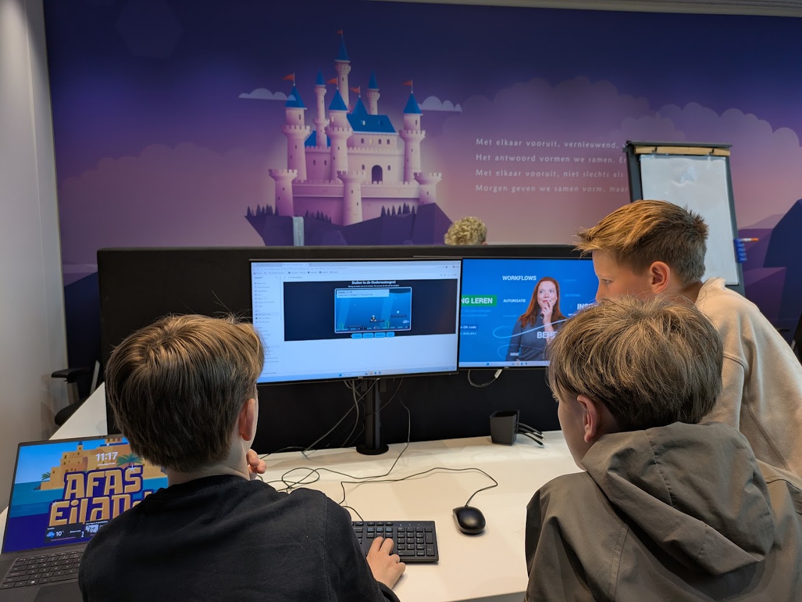
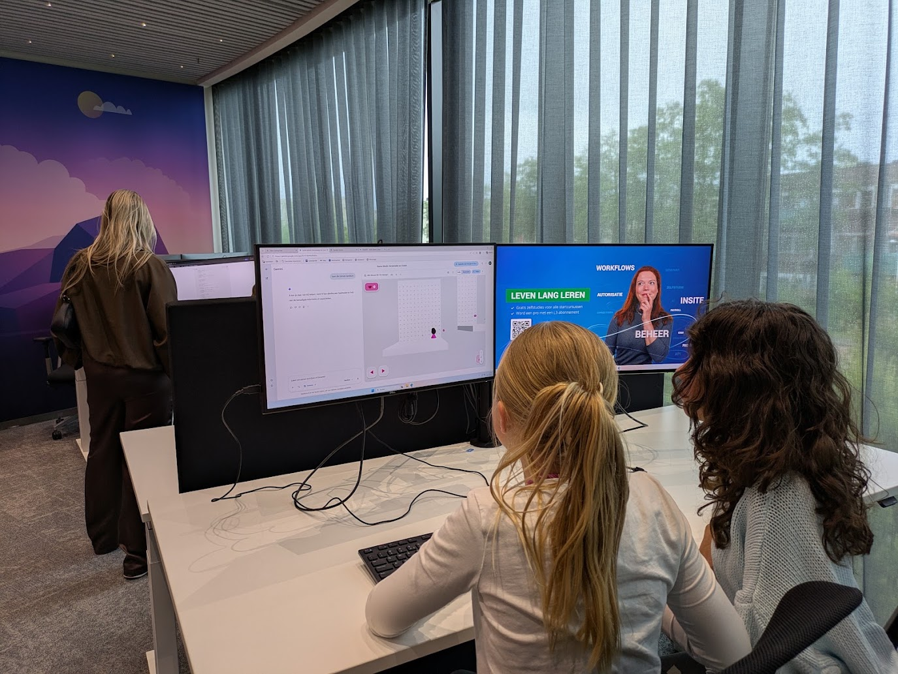
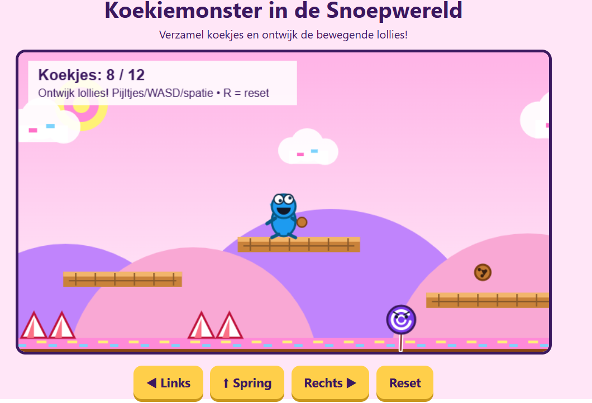
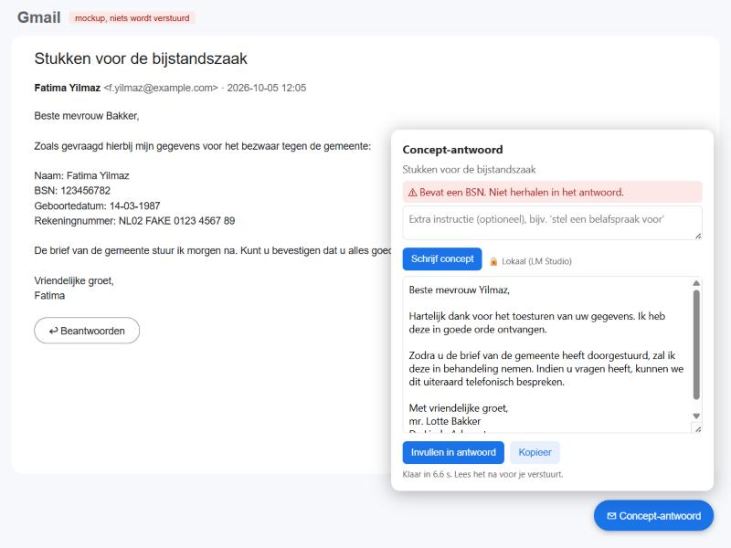

# Vibecode Friday

Bouw met AI je eigen tool

The Innovative Lawyer · 9 oktober 2026

---

## Johan Gorter

  
  <ul>
    <li>Software Architect bij AFAS Software</li>
    <li>AI-enthousiasteling</li>
    <li>Op vrijdag freelancer</li>
  </ul>

---

## Zo ziet de dag eruit

| Tijd | |
|---|---|
| 09:30 | Welkom en intro: wat is code? |
| 10:15 | Samen bouwen: Mail Chat in het demo-account |
| 11:15 | Claude test zelf in de browser |
| 11:45 | Breakout: automatisch testen |
| 12:15 | Lunch (doorbouwen mag) |
| 12:45 | Uit de praktijk: Joyce Boonstra |
| 13:05 | Doorbouwen: Mail Chat of je eigen project |
| 13:40 | Laten zien wat je gebouwd hebt |
| 14:00 | Einde |

Extra onderwerpen op aanvraag: code onderhoudbaar houden, webserver, versiebeheer, uitrollen

---

<!-- .slide: class="divider" -->

Intro

## Waarom dit ertoe doet

---

## Toronto, 2016

> "People should stop training radiologists now."

Geoffrey Hinton, "Godfather of AI", Creative Destruction Lab

Radiologen zijn als de coyote die al over de rand van de klif is gerend, maar nog niet naar beneden heeft gekeken.

Note:
Video: https://www.youtube.com/watch?v=2HMPRXstSvQ
Hinton voorspelde dat deep learning binnen 5 jaar (hooguit 10) beter zou zijn dan radiologen.

---

## Tien jaar later

  
2014
30.723

  
2023
36.024

Radiologen in de VS die Medicare-patiënten behandelen (ACR-onderzoek, 2025)

- Mayo Clinic: **+55%** radiologen sinds 2016 <!-- .element: class="fragment" -->
- Recordaantal opleidingsplekken: **1.208** in 2025 <!-- .element: class="fragment" -->
- Salaris **+48%** t.o.v. 2015, wereldwijd tekort <!-- .element: class="fragment" -->

Note:
Bronnen: Works in Progress "AI isn't replacing radiologists" (sep 2025), Fortune (mei 2026),
Jeroen Teunisse (Sogyo) "De non-coder en de augmented engineer — Deel 1".

---

## Jevons-paradox

Wordt iets goedkoper, dan gebruiken we er **meer** van

- 1865: efficiëntere stoommachine → meer kolenverbruik <!-- .element: class="fragment" -->
- Goedkopere beeldanalyse → meer scans → meer radiologen <!-- .element: class="fragment" -->
- Goedkopere software → **meer vraag naar software** <!-- .element: class="fragment" -->

Note:
Zelfde redenering voor juristen: Mr. Online, "Intelligentie als grondstof" (aug 2026).

---

## Software die er vroeger nooit was gekomen

- Deze presentatie <!-- .element: class="fragment" -->
- Mijn huis automatiseren <!-- .element: class="fragment" -->
- Een script dat saai werk doet <!-- .element: class="fragment" -->
- Een website of webapp <!-- .element: class="fragment" -->
- Een Chrome-extensie <!-- .element: class="fragment" -->

Note:
Allemaal dingen die niemand voor mij zou bouwen: te klein, te persoonlijk.

---

<!-- .slide: class="screenshot" -->
## 11-jarigen doen het al

  
  

Note:
Kinderen bouwden bij AFAS zelf een spel, zonder programmeerkennis.
Als zij het kunnen, kunt u het ook.

---

<!-- .slide: class="screenshot" -->
## Het resultaat

Note:
Een platformspel met koekjes, lollies en knoppen.

---

## Wat is vibe coding?

> "…fully give in to the vibes, embrace exponentials, and forget that the code even exists."

Andrej Karpathy, februari 2025

Jij beschrijft <strong>wat</strong> je wilt. AI schrijft de code.

---

## Wat is code?

Een map met tekstbestanden

Inhoud volgt

---

## Wat kan wel, wat (nog) niet?

### Goed

- Persoonlijke tools
- Prototypes
- Scripts en automatisering
- Data omzetten en analyseren

### Oppassen

- Systemen voor veel gebruikers
- Gevoelige gegevens
- Alles wat nooit mag falen
- Code die je niet kunt controleren

---

## Valkuilen

- **Privacy**: geen cliëntgegevens naar AI in de cloud zonder afspraken <!-- .element: class="fragment" -->
- **Geheimhouding**: weet waar je data heen gaat <!-- .element: class="fragment" -->
- **Security**: wachtwoorden en API-sleutels nooit in de code <!-- .element: class="fragment" -->
- **Scrapen**: check voorwaarden en AVG <!-- .element: class="fragment" -->
- **Vertrouwen**: AI klinkt altijd zeker, ook als het fout zit <!-- .element: class="fragment" -->

---

<!-- .slide: class="divider" -->

10:15 · Samen bouwen

## Mail Chat

---

## Wat gaan we bouwen?

Een **Chrome-extensie** met een chatpaneel naast je geopende mail in Gmail

- AI vat de mail samen <!-- .element: class="fragment" -->
- Stel vragen over de mail <!-- .element: class="fragment" -->
- **Zoek in historie**: wat speelde er eerder met deze persoon? <!-- .element: class="fragment" -->
- **Anonimiseer**: mail met Donald Duck-namen <!-- .element: class="fragment" -->
- AI draait lokaal in **LM Studio**: de mail verlaat je laptop niet <!-- .element: class="fragment" -->

Note:
Referentie: D:\github\fl-demo-walkthrough\mail-chat
Demo-account demo@johangorter.com met 15 fictieve mails. Inloggen via de 1Password-link (met 2FA).

---

## Wie doet wat?

  
Jij<small>beschrijft wat je wilt</small>

  
praat met →

  
Claude Code<small>schrijft code, kan fouten maken</small>

  
schrijft →

  
Projectmap<small>mappen met tekstbestanden</small>

  
↓ extensie uit de projectmap

  
Gmail

  
⇄ leest mail

  
Computer<small>snel, foutloos, voorspelbaar</small>

  
⇄ vraagt AI

  
Lokale AI<small>LM Studio</small>

  
Database<small>optioneel</small>

Claude Code <strong>bouwt</strong> de tool · de lokale AI <strong>leest</strong> de mail

Note:
Code = een map met tekstbestanden. Leesbaar voor mens, AI en computer.
Computer: voert code uit, snel, foutloos, altijd hetzelfde.
Claude Code: leest en schrijft code en voert taken uit, maar kan fouten maken. Draait in de cloud (VS).
Lokale AI: dommer dan Claude, maar de mail verlaat je laptop niet.
Een database hebben we vandaag niet nodig.

---

## Klaarzetten

1. **Claude desktop-app** → Code → nieuwe map `mail-chat`
2. Inloggen op het demo-account via de **1Password-link**

Note:
LM Studio en het model komen later, via de USB-stick (na de AGENTS.md-uitleg).

---

## De eerste prompt

Maak een chrome extensie die een chat paneel toont als ik in gmail een e-mail open heb. De chat begint met een bericht van AI "Ik zal de mail voor je samenvatten". De gebruiker kan onderin een nieuw chat bericht toevoegen. De aansluiting doen we in een volgende stap.

Inhoud volgt

---

## AGENTS.md

voorheen CLAUDE.md

maak een AGENTS.md bestand voor dit project. Schrijf erin dat ik advocaat ben en zelf geen code kan lezen.

Inhoud volgt

---

## AGENTS.md over meerdere sessies

Inhoud volgt

---

## De USB-stick

Start een **nieuwe, losse chat** met deze prompt:

installeer LM-studio en het model van de usb stick

Inhoud volgt

Note:
LM Studio-server: Developer-tab → Start Server (localhost:1234).
LM Studio laat zien welke variant van Gemma 4 op jouw laptop past.
Lukt het lokale model niet? Fallback: Claude Sonnet in de cloud, mag hier omdat het demo-data is.

---

## Van prompt tot skill

<svg class="hypes" viewBox="0 0 1140 380" role="img" aria-label="Hype-curves van juni 2025 tot juni 2026">
  <defs>
    <linearGradient id="hype-fill" x1="0" y1="0" x2="0" y2="1">
      <stop offset="0" stop-color="#64b5f6" stop-opacity="0.45"/>
      <stop offset="1" stop-color="#64b5f6" stop-opacity="0"/>
    </linearGradient>
  </defs>
  <g class="curves">
    <path d="M95,330 C120,330 125,200 140,200 C165,200 185,328 290,330 Z"/>
    <path d="M171,330 C196,330 201,90 216,90 C241,90 261,328 366,330 Z"/>
    <path d="M399,330 C424,330 429,140 444,140 C469,140 489,328 594,330 Z"/>
    <path d="M627,330 C652,330 657,60 672,60 C697,60 717,328 822,330 Z"/>
    <path d="M855,330 C880,330 885,150 900,150 C925,150 945,328 1050,330 Z"/>
    <path d="M969,330 C994,330 999,110 1014,110 C1039,110 1059,300 1130,322 L1130,330 Z"/>
  </g>
  <g class="labels">
    <text x="140" y="168">Context</text><text x="140" y="188">engineering</text>
    <text x="216" y="74">Beast Mode</text>
    <text x="444" y="124">Superpowers</text>
    <text x="672" y="44">OpenClaw</text>
    <text x="900" y="134">Caveman</text>
    <text x="1014" y="94">Grill-me</text>
  </g>
  <line class="as" x1="80" y1="330" x2="1120" y2="330"/>
  <g class="maanden">
    <text x="140" y="360">jun 2025</text>
    <text x="444" y="360">okt 2025</text>
    <text x="672" y="360">jan 2026</text>
    <text x="900" y="360">apr 2026</text>
  </g>
</svg>

Note:
Vraag: herkent u iets? Wie heeft van een van deze gehoord?
Daarna naar beneden voor de details.

--

## Van prompt tot skill

de hypes die vibe-coders voorbij zagen komen

  
jun 2025<strong>Context engineering</strong>Niet de formulering, maar wat je in de context stopt

  
jul 2025<strong>Beast Mode</strong>Copilot-chatmode die autonoom doorwerkt tot de taak af is

  
okt 2025<strong>Superpowers</strong>Keten van skills: brainstorm → spec → plan → TDD

  
jan 2026<strong>OpenClaw</strong>Open-source persoonlijke agent met skill-marktplaats

  
apr 2026<strong>Caveman</strong>Antwoorden in telegramstijl, tot 75% minder output-tokens

  
mei–jun 2026<strong>Grill-me</strong>De agent ondervraagt je, één vraag per keer

Elke hype volgt hetzelfde patroon: viraal via X en YouTube, binnen weken tienduizenden GitHub-sterren, daarna deels ingebouwd in de tools zelf.

Note:
1. Juni 2025 – Context engineering: opvolger van "prompt engineering": het gaat om wat je in de context stopt, niet om de formulering. Aangejaagd door Tobi Lütke en Andrej Karpathy.
2. Juli 2025 – Beast Mode: custom chat mode van Burke Holland voor GitHub Copilot in VS Code, die GPT-4.1 autonoom laat doorwerken tot de taak af is.
3. Oktober 2025 – Superpowers: plugin van Jesse Vincent (obra) voor Claude Code: een keten van skills van brainstorm via spec en plan naar TDD.
4. Januari 2026 – OpenClaw: open-source persoonlijke agent (begonnen als Clawdbot, eind 2025), viraal in januari, met eigen skill-marktplaats ClawHub.
5. April 2026 – Caveman: skill van Julius Brussee: antwoorden in telegramstijl, met een geclaimde besparing tot 75% op output-tokens.
6. Mei–juni 2026 – Grill-me: skill van Matt Pocock (bestond al sinds februari 2026): de agent ondervraagt je, één vraag per keer, tot je plan volledig is uitgewerkt.

---

## Laat je interviewen

/grill-me ik wil de ai aansluiten op lokale lm studio. Ook wil ik knoppen om AI te laten zoeken in e-mail historie en een knop om een mail te anonimiseren naar donald duck personages.

- AI stelt de vragen, jij neemt de beslissingen <!-- .element: class="fragment" -->
- Skill: aihero.dev/skills-grill-me <!-- .element: class="fragment" -->

Inhoud volgt

---

<!-- .slide: class="divider" -->

11:15

## Claude laat zelf testen

--

  
Jij

  
praat met →

  
Claude Code

  
schrijft →

  
Projectmap

  
↓ extensie uit de projectmap

  
Gmail<small>demo-account</small>

  
⇄ leest mail

  
Computer

  
⇄ vraagt AI

  
Lokale AI

  
Database

--

## Claude opent zelf de browser

met Claude in Chrome

Inhoud volgt

--

## Toegang tot het demo-account

Inhoud volgt

---

<!-- .slide: class="divider" -->

11:45 · Breakout

## Automatisch testen

--

## Iedereen dezelfde prompt

Inhoud volgt

Note:
Iedereen geeft dezelfde prompt, Claude bouwt de tests. Daarna vergelijken: wie kreeg een nep-Gmail, wie een nep-LM Studio, en waarom?

--

## Geef AI een feedbackloop

  
AI schrijft code
→
  
Test draait
→
  
AI ziet de fout
→
  
AI verbetert

- Zonder feedback gokt AI <!-- .element: class="fragment" -->
- Laat AI eerst een test schrijven, dan de code <!-- .element: class="fragment" -->

--

## Een nep-Gmail op je laptop

Bouw een nep-Gmail op `localhost:3001` met de demo-mails. Gebruik dezelfde HTML-classes als Gmail. Test de extensie daarop: open zelf de browser, klik en kijk.

- Geen echte mailbox nodig <!-- .element: class="fragment" -->
- Claude kan zelf klikken, kijken en fouten vinden <!-- .element: class="fragment" -->
- Test ook de valkuil-mails: BSN, CEO-fraude, phishing, journalist <!-- .element: class="fragment" -->

Note:
Verwachting: Claude bouwt zelf zo'n nep-Gmail. Bestaande slide uit de vorige versie (mail-beantwoorder), nog afstemmen op Mail Chat.

--

<!-- .slide: class="screenshot" -->

Note:
Screenshot van de vorige versie (mail-beantwoorder). Vervangen door Mail Chat.
De extensie herkent het BSN met vaste regels (geen AI) en maskeert het voordat de mail naar het model gaat.
Voorbeeld uit de modelvergelijking: Gemma 4 E4B zonder nadenken bevestigde aan een journalist wie de cliënt was,
terwijl de prompt dat verbiedt. Test de valkuil-mails na elke wijziging van model of prompt.

--

## Ook een nep-LM Studio?

Inhoud volgt

Note:
Verwachting: Claude maakt ook een nep-LM Studio met vaste antwoorden, zodat de tests altijd hetzelfde resultaat geven.

--

## Functionaliteit bewaken

Inhoud volgt

---

<!-- .slide: class="divider" -->

12:45 · Uit de praktijk

## Joyce Boonstra

Vibe code-projecten uit de praktijk

Note:
Na de lunch: inspiratie vlak voordat deelnemers kiezen tussen Mail Chat en een eigen project.

---

## Daarna: jouw eigen project

- Na de lunch kies je: **Mail Chat** afmaken of **je eigen project** <!-- .element: class="fragment" -->
- Begin weer met het interview <!-- .element: class="fragment" -->
- Een legal & factual matrix, een analyse van rechtspraak, slim zoeken in je eigen documenten, een eigen CRM… <!-- .element: class="fragment" -->

---

<!-- .slide: class="divider" -->

Extra

## Code onderhoudbaar houden

--

## AI meldt wanneer opruimen nodig is

Inhoud volgt

---

<!-- .slide: class="divider" -->

Extra

## Wat is een webserver?

--

  
Jij

  
praat met →

  
Claude Code

  
schrijft →

  
Projectmap

  
↓ extensie uit de projectmap

  
Gmail<small>webserver</small>

  
⇄ leest mail

  
Computer<small>browser</small>

  
⇄ vraagt AI

  
Lokale AI<small>webserver</small>

  
Database

--

## Browser ↔ webserver

  
Browser
⇄
  
Webserver

- De browser vraagt, de server antwoordt <!-- .element: class="fragment" -->
- `localhost` = een server op je eigen laptop <!-- .element: class="fragment" -->
- Alleen jij kunt erbij, veilig om te proberen <!-- .element: class="fragment" -->

--

## Je laptop draait er nu al drie

| Adres | Wat |
|---|---|
| `localhost:1234` | LM Studio: het lokale AI-model |
| `localhost:3001` | De nep-Gmail |
| `localhost:3000` | Deze presentatie |

Het getal na de dubbele punt is de poort: één deur per server

---

<!-- .slide: class="divider" -->

Extra

## Versiebeheer en backups

--

  
Jij

  
praat met →

  
Claude Code

  
schrijft →

  
Projectmap<small>met geschiedenis</small>

  
↓ extensie uit de projectmap

  
Gmail

  
⇄ leest mail

  
Computer

  
⇄ vraagt AI

  
Lokale AI

  
Database

--

## Git: een undo-knop met geschiedenis

- Elke werkende stap: **commit** <!-- .element: class="fragment" -->
- AI maakt er een puinhoop van? Terug naar de vorige versie <!-- .element: class="fragment" -->
- GitHub (privé) = backup in de cloud <!-- .element: class="fragment" -->
- Laat AI de commits voor je doen <!-- .element: class="fragment" -->

--

## Wat als je laptop kwijt is?

| Strategie | Impact |
|---|---|
| Niets | Alles weg |
| Map in OneDrive/Dropbox | Bestanden terug, geen geschiedenis |
| Git + GitHub | Alles terug, elke versie |

---

<!-- .slide: class="divider" -->

Extra

## Uitrollen

Note:
Onder voorbehoud. Uitleg op basis van een webapp, niet de extensie.

--

## VPS of cloud?

| | VPS | Cloudprovider |
|---|---|---|
| Voorbeeld | Hetzner, TransIP | Vercel, Azure, AWS |
| Kosten | Vast en laag | Per gebruik |
| Beheer | Zelf | Grotendeels geregeld |
| Data | Europa mogelijk | Vaak VS |

Soevereiniteit: onder welk recht valt jouw data?

Note:
Amerikaanse providers vallen onder de CLOUD Act, ook met datacenter in Europa.

---

## Laten zien!

Wat heb jij gebouwd?

---

<h2 class="final-question">Vragen?</h2>

---

## Bronnen

- Hinton, 2016: youtube.com/watch?v=2HMPRXstSvQ
- Works in Progress, "AI isn't replacing radiologists" (sep 2025)
- Jeroen Teunisse, "De non-coder en de augmented engineer — Deel 1" (mei 2026)
- Fortune, "A decade after the 'Godfather of AI' said radiologists were obsolete…" (mei 2026)
- Mr. Online, "Intelligentie als grondstof" (aug 2026)

